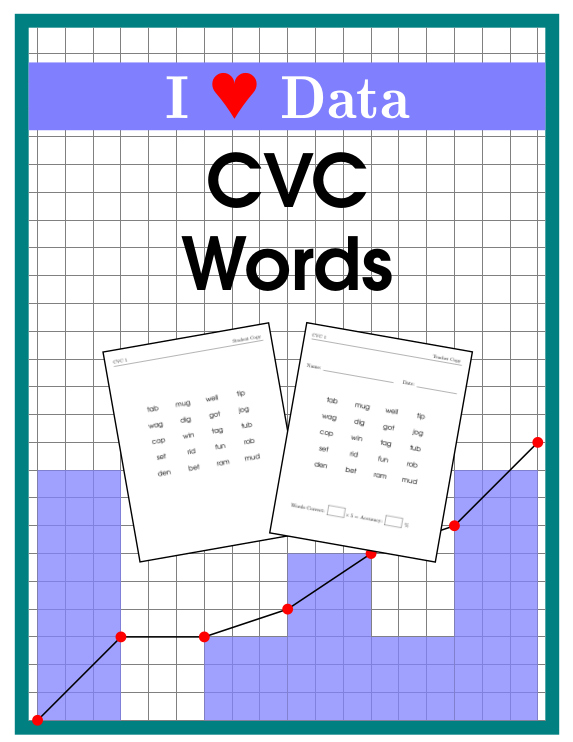
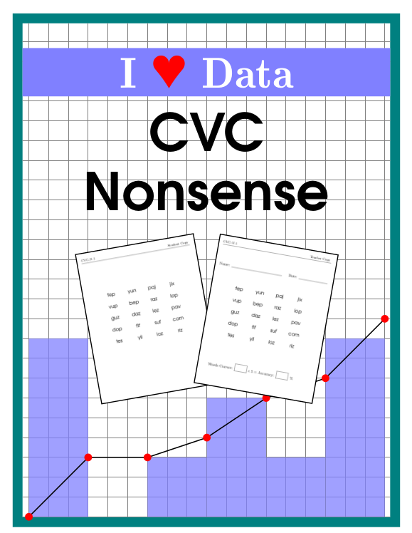
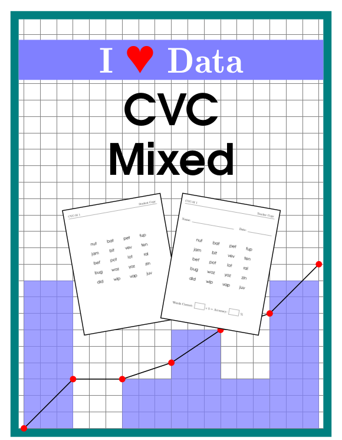
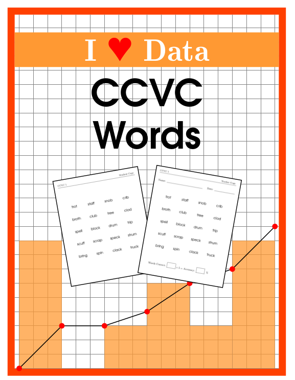
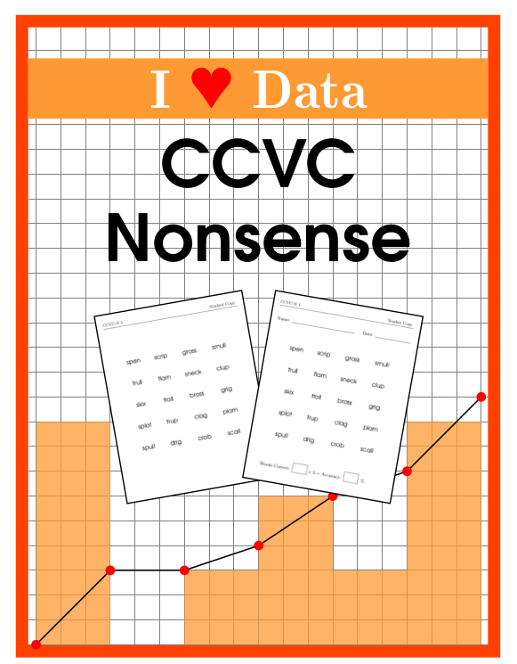
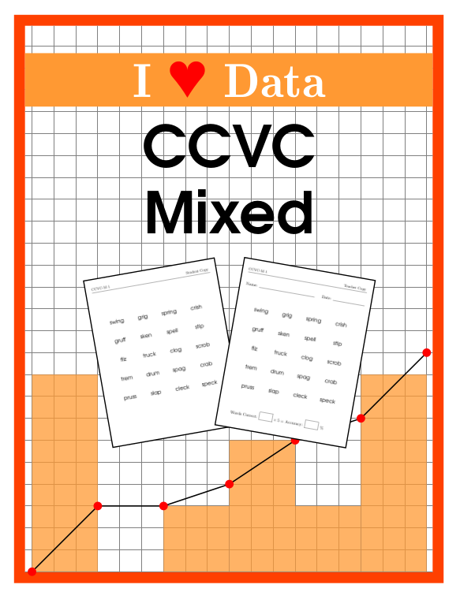
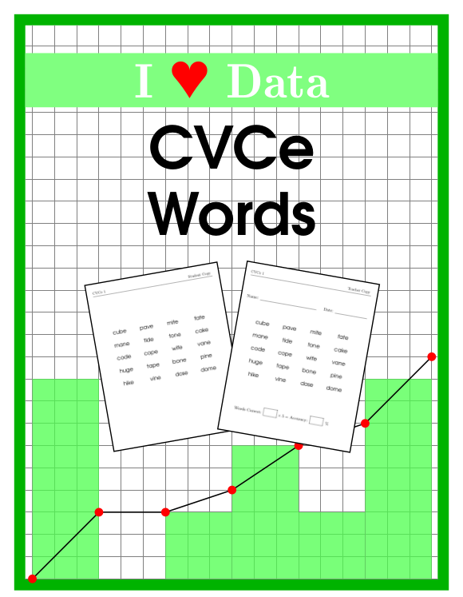
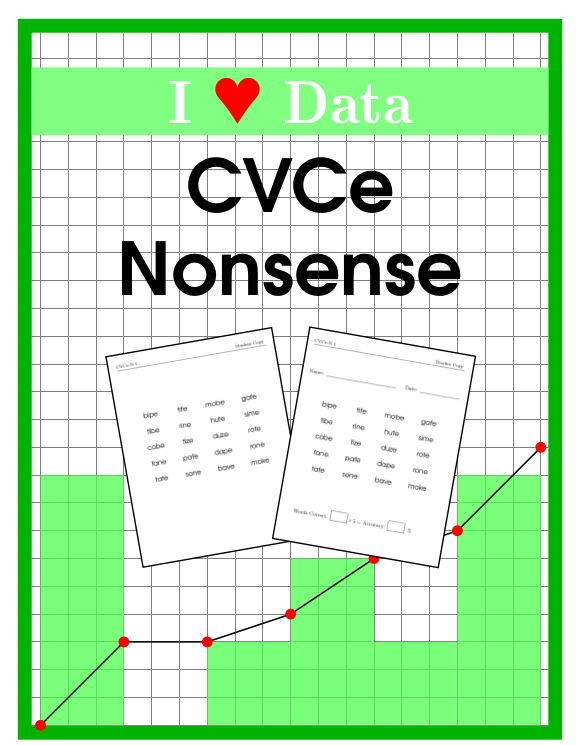
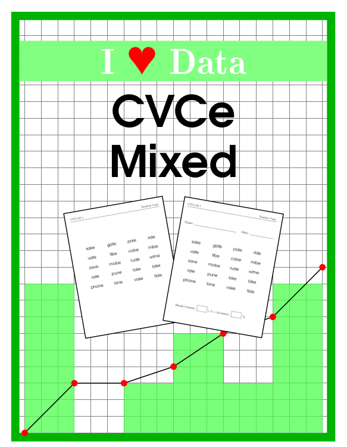
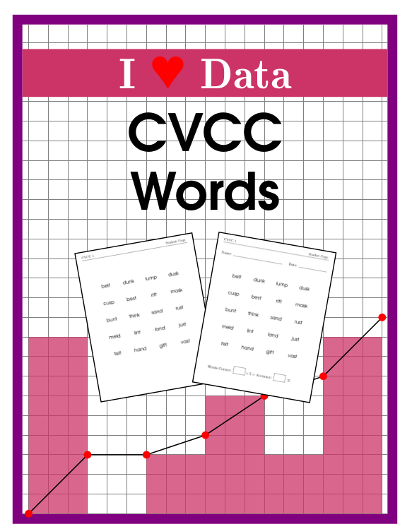

# I Heart Data

## About this Repository

Data collection allows teachers to monitor student progress and adjust the
curriculum accordingly. K-12 teachers often do not have the time to create the
tools necessary for proper data collection. This repository is the codebase for
a series of programatically generated assessments designed with long-term data
collection in mind. The goal is to make the process of data collection as easy
as possible, increasing the probability that teachers will be able to implement
these strategies. 

Table of Contents
=================

* [Single Word Reading Accuracy Assessments](#single-word-reading-accuracy-assessments)
    * [CVC words](#cvc-words)
    * [CVC nonsense](#cvc-nonsense)
    * [CVC mixed](#cvc-mixed)
    * [CCVC words](#ccvc-words)
    * [CCVC nonsense](#ccvc-nonsense)
    * [CCVC mixed](#ccvc-mixed)
    * [CVCe words](#cvce-words)
    * [CVCe nonsense](#cvce-nonsense)
    * [CVCe mixed](#cvce-mixed)
    * [CVCC words](#cvcc-words)
* [Installation](#installation)
    * [Dependencies](#dependencies)
    * [Build Instructions](#build-instructions)

# Single Word Reading Accuracy Assessments

For assessments in this collection we generate 20 random samples of 20 words
each from a large list of common words requiring a specific skill (see below).
The sample size of 20 allows for quick mental calculation of the accuracy as a
percentage, and a data table and blank graph are provided for tracking accuracy
over time. For each sample, a student copy and a teacher copy of the assessment
are generated. The student copy can either be reused for each student or given
to the student to keep, while the teacher copy is retained as a record with the
date and accuracy score.

## CVC Words


The ability to read consonant-vowel-consonant (CVC) words is an early reading
skill. Each sample of 20 words contains 4 words involving each short vowel
sound.

&nbsp;

**Included:**
* Accuracy tracking table
* Accuracy plotting
* 20 random samples of CVC words (student copies)
* 20 random samples of CVC words (teacher copies)

&nbsp;

## CVC Nonsense


Similar to CVC words, but consisting of nonsense words. 

&nbsp;

**Included:**
* Accuracy tracking table
* Accuracy plotting
* 20 random samples of CVC nonsense words (student copies)
* 20 random samples of CVC nonsense words (teacher copies)

&nbsp;

## CVC Mixed

 
A 50/50 mix of CVC words and CVC nonsense words. Each sample of 20 words
contains 4 words involving each short vowel sound, 2 of which are real words
and 2 of which are nonsense.

&nbsp;

**Included:**
* Accuracy tracking table
* Accuracy plotting
* 20 random samples of CVC mixed words (student copies)
* 20 random samples of CVC mixed words (teacher copies)

&nbsp;

## CCVC Words


These single syllable words begin with a consonant blend. Each sample of 20
contains 8 blends involving R, 6 involving S, 4 involving L, and 2 involving a
blend of three consonants.

&nbsp;

**Included:**
* Accuracy tracking table
* Accuracy plotting
* 20 random samples of CCVC words (student copies)
* 20 random samples of CCVC words (teacher copies)

&nbsp;

## CCVC Nonsense



Similar to CCVC words, but consisting of nonsense words.

&nbsp;

**Included:**
* Accuracy tracking table
* Accuracy plotting
* 20 random samples of CCVC nonsense words (student copies)
* 20 random samples of CCVC nonsense words (teacher copies)

&nbsp;

## CCVC Mixed

 
A 50/50 mix of CCVC words and CCVC nonsense words. Each sample of 20 contains 8
blends involving R (with 4 nonsense), 6 involving S (with 3 nonsense), 4
involving L (with 2 nonsense), and 2 involving a blend of three consonants
(with one nonsense).

&nbsp;

**Included:**
* Accuracy tracking table
* Accuracy plotting
* 20 random samples of CCVC mixed words (student copies)
* 20 random samples of CCVC mixed words (teacher copies)

&nbsp;

## CVCe Words


CVCe words end with a silent E creating a long vowel sound. Each sample of 20
words contains 6 words each with the vowel A, I and O, and 2 words with the
vowel U.

&nbsp;

**Included:**
* Accuracy tracking table
* Accuracy plotting
* 20 random samples of CVCe words (student copies)
* 20 random samples of CVCe words (teacher copies)

&nbsp;

## CVCe Nonsense


Similar to CVCe words, but consisting of nonsense words.

&nbsp;

**Included:**
* Accuracy tracking table
* Accuracy plotting
* 20 random samples of CVCe nonsense words (student copies)
* 20 random samples of CVCe nonsense words (teacher copies)

&nbsp;

## CVCe Mixed

 
A 50/50 mix of CVCe words and CVCe nonsense words. Each sample of 20 words
contains 6 words each with the vowel A, I and O, (each with 3 nonsense) and 2
words with the vowel U (with 1 nonsense).

&nbsp;

**Included:**
* Accuracy tracking table
* Accuracy plotting
* 20 random samples of CVCe mixed words (student copies)
* 20 random samples of CVCe mixed words (teacher copies)

&nbsp;

## CVCC Words

 

CVCC words end with a consonant blend. Each sample of 20 words contains words
ending in ST (5), SK (3), SP (1), ND (3), NT (2), NK (3), MP (2), LP or LD (2),
LT (2), FT (2).

&nbsp;

**Included:**
* Accuracy tracking table
* Accuracy plotting
* 20 random samples of CVCC words (student copies)
* 20 random samples of CVCC words (teacher copies)

&nbsp;

# Installation

The following can be used to build the worksheets on Ubuntu 16.04. 

## Dependencies

### TexLive

```shell
apt-get install texlive
```

### PDFtk (PDF toolkit)

```shell
apt-get install pdftk
```

### Python 3

It is assumed that Python 3 is installed and available as `python`. 

## Build Instructions

Clone the repository, and run `buildsheet.sh` within an assessment directory.
The .pdf output will be generated in the same directory.

```shell
git clone https://github.com/samos570/iheartdata
cd ~/ihdeartdata
cd CVCwords
./buildsheet.sh
```
